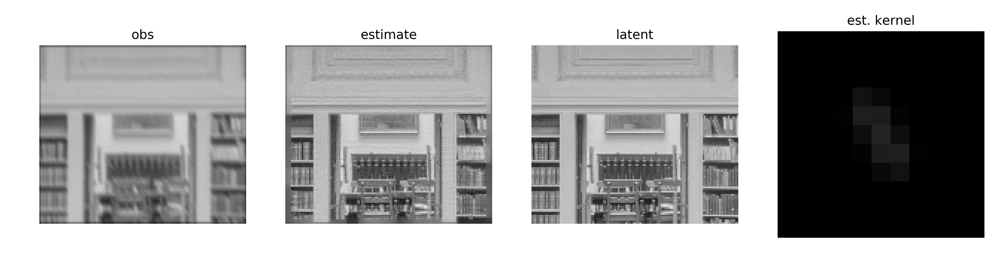
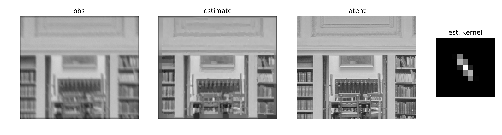
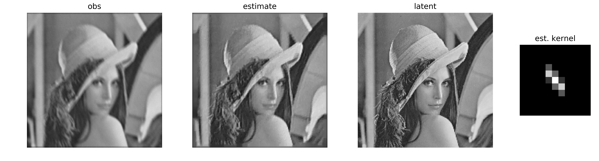
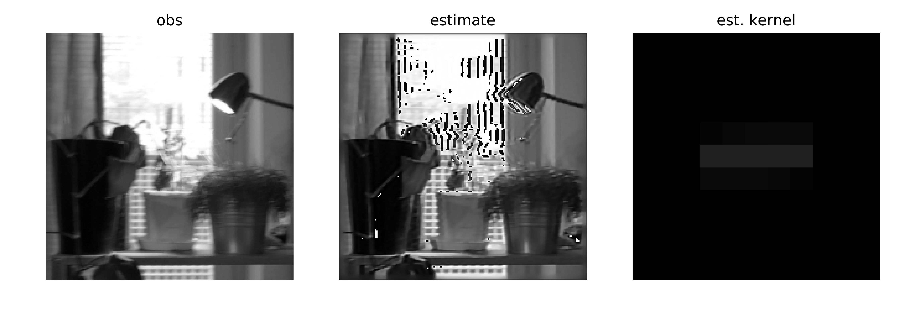

# Line deblur
Remove linear camera shake.

# Theory

Using the Bayesian formulation and assuming independence of priors, the posterior probability of the latent image (I) and kernel (K) is given as a function of their prior probability densities and observation (Y).

P(I, K|Y) ~ P(Y|I, K) P(I) P(K)

For regularization, prior information is encoded as a function of various orders of discrete differentials approximated with convolutions. Informally:

P(I) ~ *N*(I - 0.5, σ0) *N*(∇I, σ1) *N*(∇²I, σ2)

P(K) ~ constant

P(Y|I, K) ~ *N*(convolution(I, K) - Y, σobs)

Implicit in the above equations, observation standard deviation σobs and first order difference σ1 are hyperparameters with a gamma distributions.

The special feature of this solution is that the kernel is parameterized as a 2D vector, meaning that the camera shake is modeled as a convolution with a line kernel. The kernel parameters are inferred together with the image. (I can't recommend this approach -- the kernel parameter optimization seems slow and unstable.)

The estimate of the image is found in the maximum of the posterior.

Loosely based on, for example:
- Blind image deconvolution: theory and applications
- Shan et al. (2008) -- High-quality motion deblurring from a single image

# Examples

## Library without noise

A library with nice flat surfaces -- an optimal case for a model featuring a mixture prior distribution (one normal distribution capturing flat regions and another sharp jumps in intensity). Camera shake was generated.

## Library with noise

Barely perceptible normally-distributed noise will of course amplify in the result.

## Lena

With natural intensity variation. I think the waves happen because the mixture prior doesn't expect continuously varying smooth surfaces. Again, generated camera shake.

## A real-life photo with burned-out parts

Ouch! Some bits are improved (background grill, big leaf) but the clipped highlights and dark parts break the algorithm.

